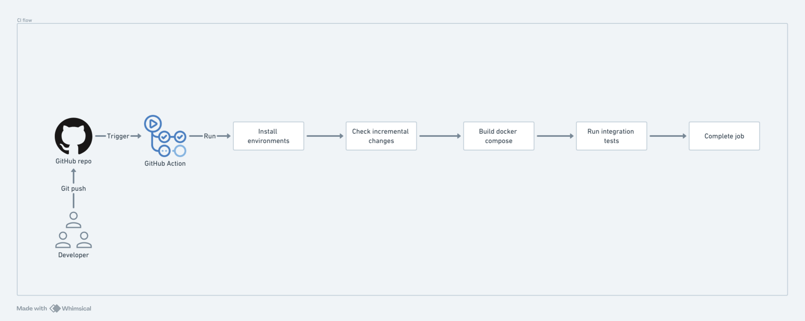

python-api-template
===


Table of contents:

[1. Introduction](#1-introduction)<br>
[2. Development guide](#2-developement-guide)<br>
[3. Three Layer Architecture](#3-three-layer-architecture)<br>
[4. CI flow](#4-ci-flow)<br>
[5. API docs](#5-api-docs)<br>


# 1. Introduction
The project shows an example for Python-Api-Template that contains 3 components:
- API services
- Postgres database
- Redis

Otherwise, it strictly enforces following conventions:
- [Google Python Style Guide](https://google.github.io/styleguide/pyguide.html)
- PEP8 standards
- Unit tests - Code coverage reaches `100%`
- Capturing incremental changes for CI-flow

# 2. Developement guide
- Bazel
```bash
$ bazel --version
bazel 7.2.1
```
- Start docker-compose:
```bash
$ make start_docker_compose
Docker compose up...
[+] Running 4/4
 ✔ Network python_api_template        Created                                                                                                    0.1s 
 ✔ Container postgres_for_python_api  Healthy                                                                                                   10.9s 
 ✔ Container redis_for_python_api     Healthy                                                                                                   10.9s 
 ✔ Container python_api               Started                                                                                                   11.0s
# Check active docker containers
$ docker ps
CONTAINER ID   IMAGE        COMMAND                  CREATED          STATUS                      PORTS                      NAMES
32baccce4f23   python_api   "uvicorn src.api.app…"   31 seconds ago   Up 20 seconds (unhealthy)   127.0.0.1:8009->8009/tcp   python_api
6456abb5c3cf   postgres     "docker-entrypoint.s…"   31 seconds ago   Up 30 seconds (healthy)     127.0.0.1:5432->5432/tcp   postgres_for_python_api
bea8c5ec53b9   redis        "docker-entrypoint.s…"   31 seconds ago   Up 30 seconds (healthy)     127.0.0.1:6379->6379/tcp   redis_for_python_api
```

- Run integration tests
```bash
$ make run_integration_tests
```

<details>
<summary>Click here to see output</summary>

```bash
► Start integration tests...
 connected 
-----------
         1
(1 row)

OK
Redis: count keys=0
⇨ Test api_health_check
__Passed__: actual={"message":"200 OK"} == expected={"message":"200 OK"}
⇨ Test empty user_list
__Passed__: actual={"total":0,"count":0,"users":[]} == expected={"total":0,"count":0,"users":[]}
⇨ Test create_user
__Passed__: actual={"message":"created"} == expected={"message":"created"}
__Passed__: actual={"message":"created"} == expected={"message":"created"}
__Passed__: actual={"message":"created"} == expected={"message":"created"}
__Passed__: actual=3 == expected=3
⇨ Test user_login
__Passed__: actual=bearer == expected=bearer
__Passed__: actual={"error":"Incorrect username or password"} == expected={"error":"Incorrect username or password"}
⇨ Test update_user
__Passed__: actual={"message":"updated"} == expected={"message":"updated"}
__Passed__: actual=3 == expected=3
⇨ Test update_username
__Passed__: actual={"detail":[{"type":"missing","loc":["body","password"],"msg":"Field required","input":{"username":"f8"}}]} == expected={"detail":[{"type":"missing","loc":["body","password"],"msg":"Field required","input":{"username":"f8"}}]}
⇨ Test update_user failed
__Passed__: actual={"error":"Invalid credentials"} == expected={"error":"Invalid credentials"}
⇨ Test delete_user
__Passed__: actual={"message":"deleted"} == expected={"message":"deleted"}
__Passed__: actual=2 == expected=2
⇨ Test get_user
__Passed__: actual=$2b$12$eeeeeeeeeeeeeeeeeeeeeedJLEz7e/.bs.BVKXsxbOT1ORiO5/EAe == expected=$2b$12$eeeeeeeeeeeeeeeeeeeeeedJLEz7e/.bs.BVKXsxbOT1ORiO5/EAe
⇨ Test get_user by invalid credentials
__Passed__: actual={"error":"Invalid credentials"} == expected={"error":"Invalid credentials"}
► Done integration test!
```
</details>

- Stop docker-compose
```bash
$ make stop_docker_compose
Docker compose down...
[+] Running 4/4
 ✔ Container python_api               Removed                                                                                                    0.6s 
 ✔ Container redis_for_python_api     Removed                                                                                                    0.2s 
 ✔ Container postgres_for_python_api  Removed                                                                                                    0.2s 
 ✔ Network python_api_template        Removed                                                                                                    0.1s 
```

# 3. Three Layer Architecture
```bash
$ tree -L 1 src/
src/
├── api
├── common
├── db
├── repositories
├── schemas
└── services
```
## Interface layer
The interface layer includes `api` module and `schemas` module. That should define API endpoints and interact with service layer.

## Service layer
The service layer includes `services` module. That should store business logic. Service layer acts as an intermediate layer between the Interface layer and Database layer.

## Database layer
The database layer includes `repositories` module and `db` module. That should contain database connectors, data models. This layer accepts the processed data from the service layer and perform queries and operations to interact with the database.

# 4. CI flow
<p style="text-align:center;"></p>

The image above illustrates CI-flow. In particular,
- `Install environments`: set up OS, Git env, also, install Bazel.
- `Check incremental changes`: get changed files from Git and detect dependencies by Bazel. After that, it verifies Pep8 convention and runs unit tests that qualifies 100% code coverage as criteria.
- `Build docker compose`: build FastAPI service and Postgres DB
- `Run integration tests`: execute bash script to run test cases.
- `Complete job`: clean up orphan processes.

# 5. API docs
- Host: http://127.0.0.1:8009/api/v1
- Swagger UI: http://127.0.0.1:8009/docs
## Health check
*Get API health check*

- **URL:** `/api/v1/health`
- **Method:** `GET`
- **Success Response:**
    - Code: `200`
    - Content:
    ```python
    {
        "message": "200 OK"
    }
    ```

## Create User
*Insert user record*

- **URL:** `/api/v1/user`
- **Method:** `POST`
- **Payload**
  ```python
  {
    "name": string,
    "password": string
  }
  ```
- **Success Response:**
    - Code: `200`
    - Content:
    ```python
    {
        "message": "created"
    }
    ```
## Login
*Login by user credentials*

- **URL:** `/api/v1/auth`
- **Method:** `POST`
- **Form**
    - `grant_type`(string): `password`
    - `username`(string)
    - `password`(string)
- **Success Response:**
    - Code: `200`
    - Content:
    ```python
    {
        "access_token": "token value here",
        "token_type": "bearer"
    }
    ```

## Update User
*Update user information*

- **URL:** `/api/v1/user`
- **Method:** `PUT`
- **Header**
    - `'Content-Type: application/json'`
    - `Authorization: Bearer {access_token}`
- **Payload**: `{"name": string}`
- **Success Response:**
    - Code: `200`
    - Content:
    ```python
    {
        "message": "updated"
    }
    ```
## Delete User
*Delete user record*

- **URL:** `/api/v1/user`
- **Method:** `DELETE`
- **Header**
    - `'Content-Type: application/json'`
    - `Authorization: Bearer {access_token}`
- **Success Response:**
    - Code: `200`
    - Content:
    ```python
    {
        "message": "deleted"
    }
    ```

## Get User
*Get user information*

- **URL:** `/api/v1/user`
- **Method:** `GET`
- **Header**
    - `'Content-Type: application/json'`
    - `Authorization: Bearer {access_token}`
- **Success Response:**
    - Code: `200`
    - Content:
    ```python
    {
        "uuid": "a00a0aaa-0aa0-00a0-00aa-0a0aa0aa00a0",
        "name": "alice",
        "password": "$dagdagdga%dadadad"
    }
    ```

## List User
*Get list of user information*

- **URL:** `/api/v1/user/list?start={1}&page_size={2}`
- **Method:** `GET`
- **Params**:
    - `start`(integer): start index of user list
    - `page_size`(integer): number of records per request
- **Success Response:**
    - Code: `200`
    - Content:
    ```python
    {
        "total": 2,
        "count": 2,
        "users": [
            {
                "name": "user1",
                "uuid": "d785d88d-a8c0-4e3a-8500-9ab68239ecc1"
            },
            {
                "name": "user2",
                "uuid": "16d68d9a-f95d-42b1-9ce6-ddcac019cc57"
            }
        ]
    }
    ```

